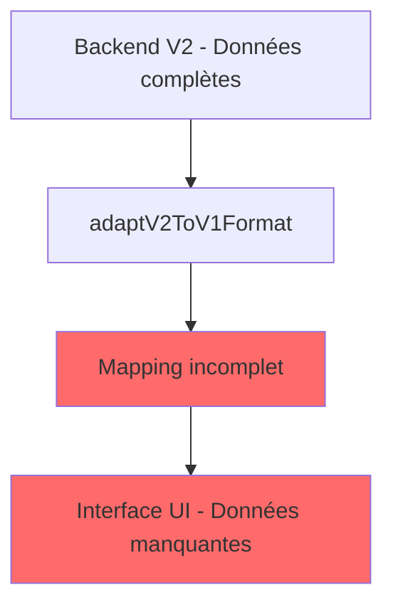

# 🔬 DIAGNOSTIC TECHNIQUE - CORRECTION MAPPING V2 → FRONTEND

> **CORRECTION CRITIQUE - AFFICHAGE DONNÉES V2**  
> *Version : 1.0 - 13 septembre 2025*  
> *Objectif : Corriger le mapping backend V2 → interface utilisateur*

---

## 🎯 **PROBLÈME IDENTIFIÉ**

### **SITUATION ACTUELLE**
- **Backend V2** : ✅ Fonctionne parfaitement (pipeline 4 étapes IA-First)
- **Interface UI** : ✅ Bien conçue et responsive
- **Mapping V2→V1** : ❌ **DÉFAILLANT** - Les données ne s'affichent pas

### **IMPACT UTILISATEUR**
- Page résultats vide ou incomplète
- Routine personnalisée non affichée
- Produits recommandés manquants
- Scores et diagnostic partiels

---

## 🏗️ **ARCHITECTURE PROBLÉMATIQUE ACTUELLE**

### **🔍 FLUX DE DONNÉES DÉFAILLANT**



### **📊 ANALYSE DES DÉFAILLANCES**

| Composant | État | Problème Identifié |
|-----------|------|-------------------|
| **Backend V2** | ✅ Parfait | Pipeline 4 étapes fonctionne |
| **Données brutes** | ✅ Complètes | diagnostic, routine, products OK |
| **adaptV2ToV1Format()** | ❌ Défaillant | Mapping incomplet des champs |
| **convertV2RoutineToUnified()** | ❌ Défaillant | Champs critiques manquants |
| **Interface UI** | ✅ Prête | Attend les bonnes données |

---

## 🔧 **SPRINTS DE CORRECTION**

### **🚀 SPRINT 1 : CORRECTION MAPPING CRITIQUE**
*Durée : 2-3h | Priorité : CRITIQUE*

**Objectif :** Corriger le mapping des données essentielles pour affichage immédiat

**Tâches :**
1. **Corriger `convertV2RoutineToUnified()`**
   - Ajouter champs manquants : `description`, `applicationDuration`, `category`
   - Intégrer produits dans chaque étape de routine
   - Mapper correctement `frequency` et `timeOfDay`

2. **Enrichir `adaptV2ToV1Format()`**
   - Mapper `beautyAssessment.specificities` depuis `zoneSpecificIssues`
   - Créer `overview` enrichi depuis `generalObservation`
   - Ajouter `improvementTimeEstimate` calculé

3. **Validation mapping produits**
   - Intégrer `catalogId` dans `recommendedProducts`
   - Mapper `applicationAdvice` et `restrictions`
   - Assurer cohérence produits ↔ routine

**Livrables :**
- Fonction `convertV2RoutineToUnified()` corrigée
- Fonction `adaptV2ToV1Format()` enrichie
- Tests de mapping avec données réelles

### **⚡ SPRINT 2 : OPTIMISATION AFFICHAGE**
*Durée : 1-2h | Priorité : HAUTE*

**Objectif :** Optimiser l'affichage des données mappées

**Tâches :**
1. **Badges et timing intelligents**
   - Badges temporaires basés sur `applicationDuration`
   - Couleurs de phase basées sur `category`
   - Timing précis basé sur `frequency`

2. **Intégration produits avancée**
   - Liens d'affiliation fonctionnels
   - Justifications personnalisées affichées
   - Fallbacks robustes pour produits manquants

3. **Gestion des zones spécifiques**
   - Affichage correct des `targetZones`
   - Badges de zones différenciés
   - Mapping `zoneSpecificIssues` → interface

**Livrables :**
- Affichage badges et timing optimisé
- Intégration produits complète
- Gestion zones spécifiques fonctionnelle

### **🔍 SPRINT 3 : VALIDATION ET ROBUSTESSE**
*Durée : 1-2h | Priorité : MOYENNE*

**Objectif :** Assurer la robustesse et la compatibilité

**Tâches :**
1. **Tests de compatibilité**
   - Validation avec anciennes analyses V1
   - Tests avec données V2 incomplètes
   - Fallbacks pour champs manquants

2. **Gestion d'erreurs avancée**
   - Fallbacks intelligents par section
   - Messages d'erreur utilisateur-friendly
   - Logging détaillé pour debug

3. **Optimisations performance**
   - Cache des mappings fréquents
   - Optimisation des transformations
   - Réduction des re-renders

**Livrables :**
- Suite de tests complète
- Gestion d'erreurs robuste
- Performance optimisée

### **📈 SPRINT 4 : AMÉLIORATIONS UX**
*Durée : 2-3h | Priorité : BASSE*

**Objectif :** Améliorer l'expérience utilisateur

**Tâches :**
1. **Affichage enrichi**
   - Animations pour nouvelles données
   - Tooltips explicatifs
   - Indicateurs de personnalisation IA

2. **Fonctionnalités avancées**
   - Export PDF avec nouvelles données
   - Partage optimisé
   - Analytics d'affichage

3. **Interface éducative**
   - Explications des phases
   - Conseils d'application détaillés
   - Progression visuelle

**Livrables :**
- Interface enrichie et éducative
- Fonctionnalités avancées
- Analytics intégrées

---

## 📐 **SPÉCIFICATIONS TECHNIQUES DÉTAILLÉES**

### **🔧 CORRECTION `convertV2RoutineToUnified()`**

```typescript
// ✅ STRUCTURE CIBLE
interface UnifiedRoutineStep {
  stepNumber: number
  title: string
  description: string // ← MANQUANT
  targetArea: 'specific' | 'global'
  zones: string[]
  recommendedProducts: ProductInfo[] // ← MAL INTÉGRÉ
  applicationAdvice: string
  applicationDuration: string // ← MANQUANT
  restrictions: string[]
  category: string // ← MANQUANT
  frequency: 'daily' | 'weekly' | 'monthly' // ← MAL MAPPÉ
  timeOfDay: 'morning' | 'evening' | 'both'
  phase: 'immediate' | 'adaptation' | 'maintenance'
}
```

### **🔧 CORRECTION `adaptV2ToV1Format()`**

```typescript
// ✅ STRUCTURE CIBLE
interface BeautyAssessment {
  skinType: string
  mainConcern: string
  intensity: string
  specificities: Array<{ // ← MANQUANT
    name: string
    intensity: string
    zone: string
  }>
  overview: string[] // ← MANQUANT
  improvementTimeEstimate: string // ← MANQUANT
  zoneSpecific: Array<{
    zone: string
    problems: Array<{
      type: string
      intensity: string
      description: string
    }>
  }>
}
```

---

## ⚠️ **POINTS DE VIGILANCE**

### **Risques Techniques**
- **Compatibilité V1** : Maintenir support anciennes analyses
- **Performance** : Éviter sur-transformation des données
- **Cohérence** : Assurer mapping bidirectionnel correct

### **Stratégies de Mitigation**
- **Tests exhaustifs** : Validation avec vraies données logs
- **Fallbacks robustes** : Valeurs par défaut pour tous champs
- **Logging détaillé** : Traçabilité des transformations

---

## 📊 **MÉTRIQUES DE SUCCÈS**

### **Objectifs Quantifiés**
- **Affichage complet** : 100% des données V2 visibles
- **Compatibilité** : 100% analyses V1 fonctionnelles
- **Performance** : <100ms transformation mapping
- **Robustesse** : 0% erreur affichage avec données valides

### **Indicateurs Clés**
- **Routine affichée** : 3 phases + étapes + produits
- **Scores visibles** : 8 critères + justifications
- **Produits intégrés** : catalogId + liens + conseils
- **Zones spécifiques** : Mapping correct + badges

---

## 🚀 **AVANTAGES POST-CORRECTION**

### **Vs État Actuel**
| Aspect | Actuel | Post-Correction |
|--------|--------|-----------------|
| **Affichage routine** | ❌ Vide/Partiel | ✅ Complet 3 phases |
| **Produits intégrés** | ❌ Séparés | ✅ Dans routine |
| **Données V2** | ❌ Perdues | ✅ 100% affichées |
| **UX utilisateur** | ❌ Frustrante | ✅ Fluide |

### **Bénéfices Business**
- **Rétention** : Utilisateurs voient leurs résultats
- **Conversion** : Produits correctement affichés
- **Satisfaction** : Expérience complète et cohérente
- **Fiabilité** : Backend V2 enfin exploité

---

## 📅 **PLANNING D'IMPLÉMENTATION**

### **Phase 1 : Correction Critique (Jour 1)**
- Sprint 1 complet
- Tests avec données logs
- Validation affichage de base

### **Phase 2 : Optimisation (Jour 2)**
- Sprint 2 complet
- Tests UX avancés
- Validation produits intégrés

### **Phase 3 : Robustesse (Jour 3)**
- Sprint 3 complet
- Tests de compatibilité
- Validation performance

### **Phase 4 : Améliorations (Jour 4-5)**
- Sprint 4 complet
- Tests utilisateur
- Documentation finale

---

*Diagnostic Technique Mapping V2 → Frontend - DermAI V2*  
*Version 1.0 - Correction Critique*  
*13 septembre 2025*
